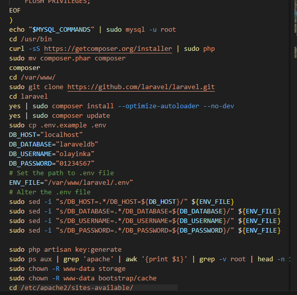
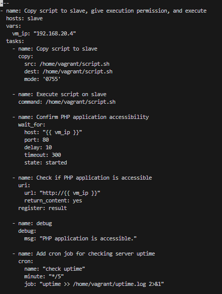

# 3MTT Cloud Engineering – Beginner Module Assessment

## Objective

- Automate the provisioning of two Ubuntu-based servers, named “Master” and “Slave”, using Vagrant.
- On the Master node, create a bash script to automate the deployment of a LAMP (Linux, Apache, MySQL, PHP) stack.
- This script should clone a PHP application from GitHub, install all necessary packages, and configure Apache web server and MySQL. 
- Ensure the bash script is reusable and readable.
- Using an Ansible playbook:

    1. Execute the bash script on the Slave node and verify that the PHP application is accessible through the VM’s IP address (take screenshot of this as evidence)
    2. Create a cron job to check the server’s uptime every 12 am.

## Requirements

1. Submit the bash script and Ansible playbook to (publicly accessible) GitHub repository.
2. Document the steps with screenshots in md files, including proof of the application’s accessibility (screenshots taken where necessary)
3. Use either the VM’s IP address or a domain name as the URL.

PHP Laravel GitHub Repository:

https://github.com/laravel/laravel

## Solution

To solve the above problem, we create a step by step plan as below:

1. Create a vagrant file uysing the command `touch vagrantfile`

2. Configure it manually specifyng the master and the slave

3. Vagrant validate - if valid do varant up and ssh into the master.
vagrant validate

vagrant up

ssh into the master

4. Compile manual command to form a script.

5. In the script, run updates and then commands to install apache2, php, and mysquel

6. Clone and run LAMP/Laravel setup in the script. 

7. Configure the script to work automatically.

8. Install Ansible on the master.

9. SSH into slave

10. Connect master to slave by generating ssh-keys on master and sharing the public key with the slave.

11. Write ansible playbook and inventory file on the master.

12. ping slave from master.

13. If ping is successful, run the playbook.

Playbook script

Run playbook

Laravel website installed on slave using ansible

